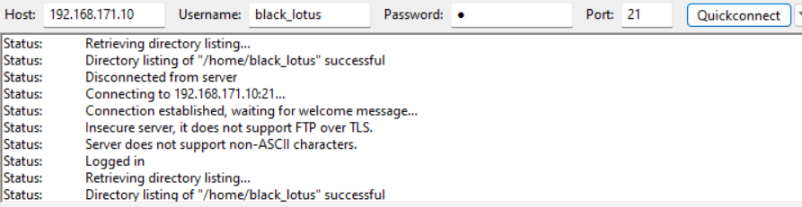

# FINAL-PROJECT-OS-SERVER-SYSTEM-ADMIN---22.83.0886

Repository ini berisi dokumentasi yang menjelaskan cara instalasi dan konfigurasi berbagai layanan server, seperti SSH, DHCP, FTP/Samba, DNS, mail server, dan web server, serta Database Server. Dokumen ini ditujukan untuk memandu pengguna dalam mengatur dan mengelola server-server ini dengan langkah-langkah yang jelas.

## Daftar Isi
1. [Instalasi dan Konfigurasi SSH](#1-instalasi-dan-konfigurasi-ssh-server)
2. [Instalasi dan Konfigurasi DHCP Server](#2-instalasi-dan-konfigurasi-dhcp-server)
3. [Instalasi dan Konfigurasi FTP dan Samba Server](#3-instalasi-dan-konfigurasi-ftp-dan-samba-server)
4. [Instalasi dan Konfigurasi Web Server](#4-instalasi-dan-konfigurasi-web-server)
5. [Instalasi dan Konfigurasi DNS Server](#5-instalasi-dan-konfigurasi-dns-server)
6. [Instalasi dan Konfigurasi Database Server](#6-instalasi-dan-konfigurasi-database-server)
7. [Instalasi dan Konfigurasi Mail Server](#7-instalasi-dan-konfigurasi-mail-server)
   

## 1. Instalasi dan Konfigurasi SSH Server

### 1.1 Instalasi SSH
**Langkah 1: Lakukan Instalasi Paket SSH Server**

```
apt-get install openssh-server
```
### 1.2 Konfigurasi SSH
**Langkah 1: Buka Direktori konfigurasi ssh dengan text editor(disini saya menggunakan nano)**
```
nano /etc/ssh/sshd_config
```
**Langkah 2: Edit Konfigurasi seperti dibawah ini**
```
Include /etc/ssh/sshd_config.d/*.conf

Port 9029
#AddressFamily any
#ListenAddress 0.0.0.0
#ListenAddress ::

#HostKey /etc/ssh/ssh_host_rsa_key
#HostKey /etc/ssh/ssh_host_ecdsa_key
#HostKey /etc/ssh/ssh_host_ed25519_key

# Ciphers and keying
#RekeyLimit default none

# Logging
#SyslogFacility AUTH
#LogLevel INFO

# Authentication:

#LoginGraceTime 2m
PermitRootLogin yes
#StrictModes yes
#MaxAuthTries 6
#MaxSessions 10

#PubkeyAuthentication yes

# Expect .ssh/authorized_keys2 to be disregarded by default in future.
#AuthorizedKeysFile     .ssh/authorized_keys .ssh/authorized_keys2

#AuthorizedPrincipalsFile none

#AuthorizedKeysCommand none
#AuthorizedKeysCommandUser nobody
```
Saya mengubah Port dari 22 ke 9029 untuk mengamankanya agar tidak menggunakan default port,dan untuk "PermitRootLogin" bisa di biarkan "prohibit-password" jika anda tidak mengizikan root untuk login dengan remote SSH

**Langkah 3: Restart layanan SSH Server**
```
systemctl restart sshd
```
### 1.3 Menguji Konfigurasi
```
ssh root@IPADDR -p 9029
```
Bisa disesuaikan dengan IP dan Port yang anda konfigurasi

## 2. Instalasi dan Konfigurasi DHCP Server

### 2.1 Instalasi DHCP
**Langkah 1: Instalasi Paket DHCP Server**
```
apt-get install isc-dhcp-server
```
Jika anda menggunakan basis Linux Distro Red Hat Enterprise Linux (RHEL) seperti centos biasanya nama paket nya adalah:
```
yum install dhcp
```
### 2.2 Konfigurasi DHCP Server
**Langkah 1: Buka Direktori Konfigurasi DHCPD**
```
nano /etc/dhcp/dhcpd.conf
```
**Langkah 2: Edit Konfigurasi file Seperti dibawah ini**
```
Line 49
# A slightly different configuration for an internal subnet.
#subnet 10.5.5.0 netmask 255.255.255.224 {
#  range 10.5.5.26 10.5.5.30;
#  option domain-name-servers ns1.internal.example.org;
#  option domain-name "internal.example.org";
#  option routers 10.5.5.1;
#  option broadcast-address 10.5.5.31;
#  default-lease-time 600;
#  max-lease-time 7200;
#}
```
Sesuaikan dengan IP Address,Prefix dan Hostname Server Anda
```
subnet 192.168.171.0 netmask 255.255.255.0 {
  range 192.168.171.11 192.168.171.254;
  option domain-name-servers 192.168.171.10,1.1.1.1;
  option domain-name "finalprojectku.com";
  option routers 192.168.171.10;
  option broadcast-address 192.168.171.255;
  default-lease-time 600;
  max-lease-time 7200;
}
```
**Langkah 3: Deklarasikan DHCP Server dengan interface yang akan anda fungsikan sebagai DHCP Server**
```
nano /etc/default/isc-dhcp-server
```
Sesuaikan dengan interface yang anda gunakan
```
INTERFACES=""
```
seperti ini:
```
INTERFACES="enp0s8"
```
**Langkah 4: Restart Layanan DHCPD**
```
systemctl restart isc-dhcp-server
```
### 2.3 Menguji Konfigurasi

1.Dari sisi Client anda bisa melakukan Request IP ke DHCP POOL(saya menggunakan Windows sebagai Client)


2.Dari sisi Server anda bisa mengamati bahwa ada activity bahwa DHCP meminjamkan IP ke Client
```
Oct 29 02:37:17 finalprojectku systemd[1]: Starting isc-dhcp-server.service - LSB: DHCP server...
Oct 29 02:37:17 finalprojectku isc-dhcp-server[16797]: Launching IPv4 server only.
Oct 29 02:37:17 finalprojectku isc-dhcp-server[16797]: Starting ISC DHCPv4 server: dhcpdingore stale pid file /var/run/dhcpd.pid
Oct 29 02:37:19 finalprojectku isc-dhcp-server[16797]: .
Oct 29 02:37:19 finalprojectku systemd[1]: Started isc-dhcp-server.service - LSB: DHCP server.
Oct 29 02:45:14 finalprojectku dhcpd[16734]: DHCPDISCOVER from 0a:00:27:00:00:1e via enp0s8
Oct 29 02:45:15 finalprojectku dhcpd[16734]: DHCPOFFER on 192.168.171.11 to 0a:00:27:00:00:1e (MNHAQIQI) via enp0s8
Oct 29 02:45:15 finalprojectku dhcpd[16734]: DHCPREQUEST for 192.168.171.11 (192.168.171.10) from 0a:00:27:00:00:1e (MNHAQIQI) via enp0s8
Oct 29 02:45:15 finalprojectku dhcpd[16734]: DHCPACK on 192.168.171.11 to 0a:00:27:00:00:1e (MNHAQIQI) via enp0s8
```
## 3. Instalasi dan Konfigurasi FTP dan Samba Server
Samba dan FTP (vsftpd) adalah dua layanan yang memiliki fungsi serupa, yaitu memungkinkan pertukaran file dan berbagi sumber daya di jaringan. Keduanya digunakan untuk mentransfer file antara komputer dalam jaringan,Karena itu saya akan Mendokumentasikanya dalam 1 bab saja
### 3.1 Instalasi FTP dan Samba
**Langkah 1: Instalasi Paket samba**
```
apt update
apt-get install samba
```
**Langkah 2: Instalasi Paket VSFTPD(FTP)y**
Sepertinya ada banyak pilihan seperti "PROFTPD" tapi disini saya menggunakan VSFTPD
```
apt update
apt-get install vsftpd
```

### 3.2 Konfigurasi Samba

**Langkah 1: Lakukan Backup Konfigurasi Default**
```
cp /etc/samba/smb.conf /etc/samba/smb.conf.backup
```
**Langkah 2: Hapus isi Konfigurasi didalam file samba.conf**
```
echo "" | tee /etc/samba/smb.conf
```
**Langkah 3: Buka file konfigurasi Utama Samba**
```
nano /etc/samba/smb.conf
```
**Langkah 4: isi file Konfigurasi**
```
[anonymous]
path = /home/public
public = yes
writable = yes
guest ok = yes
guest only = yes

#=========================================================================#
[Fenrir Group]
path = /home/private
public = no
writeable = yes
valid user = fenrir_group
```
Dalam Sekenario ini,saya membuat 2 Direktori yaitu:

public = untuk user umum

private = untuk user group tertentu

**Langkah 5: Membuat Direktori dan Konfigurasi User**
```
mkdir /home/public
mkdir /home/private
groupadd fenrir_group
useradd -G fenrir_group fenrir
smbpasswd -a fenrir
New SMB password:
Retype new SMB password:
Added user fenrir.
```
**Langkah 6: Set permission untuk kedua Direktori**
```
chmod 777 /home/public
chmod 770 /home/private
chown :fenrir_group /home/private
```
**Langkah 7: Restart Service SMB**
```
systemctl restart smbd
```
### 3.3 Konfigurasi VSFTPD(FTP)
**Langkah 1: Buka File Konfigurasi Utama Vsftpd**
```
nano /etc/vsftpd.conf
```
**Langkah 2 : Lakukan Perubahan Konfigurasi berikut :**
```
listen=YES
listen_ipv6=NO
anonymous_enable=NO
#HILANGKAN TANDA PAGAR PADA LINE KONFIGURASI DIBAWAH INI#
write_enable=YES
local_umask=022
ascii_upload_enable=YES
ascii_download_enable=YES
chroot_local_user=YES
chroot_list_enable=YES
chroot_list_file=/etc/vsftpd.chroot_list
ls_recurse_enable=YES
```
**Langkah 3: Menambahkan User baru dan Memasukanya ke list chroot**
Menambahkan user baru
```
useradd black_lotus
passwd black_lotus
New password:
Retype new password:
passwd:
password updated successfully
```
menambahkan user baru ke list 
```
nano /etc/vsftpd.chroot_list
#Tambahkan user baru di direktori ini
black_lotus
```
**Langkah 4: Restart Layanan Vsftpd**
```
systemctl restart vsftpd
```
### 3.4 Pengujian Konfigurasi

1. Samba Server
  ini adalah pengujian dari sisi client


ini tampilan dari isi direkotori Samba yang diKonfigurasi sebelumnya :


2. FTP Server
   ini adalah Tampilan dari FTP client(Menggunakan Filezila)



## 4. Instalasi dan Konfigurasi Web Server
Saya memilih untuk menggunakan Apache2 sebagai server web utama untuk proyek saya daripada Nginx. tidak ada alasan khusus saya memilih apache2,anda bisa memilih Nginx. saya juga akan menginstall CMS wordpress untuk Webserver ini.Apache2 memiliki dukungan yang baik untuk PHP, yang merupakan salah satu persyaratan utama untuk menjalankan WordPress dengan lancar.

### 4.1 Instalasi Apache2

**Langkah 1: Instalasi Paket Apache2**
```
apt update
apt-get install apache2
```
### 4.2 Konfigurasi Apache2
**Langkah 1: Buka File Konfigurasi Apache2**
```
nano /etc/apache2/sites-available/000-default.conf
```
**Langkah 2: Sesuaikan Konfigurasi ini dengan domain yang anda gunakan**
```
<VirtualHost *:80>
        # The ServerName directive sets the request scheme, hostname and port that
        # the server uses to identify itself. This is used when creating
        # redirection URLs. In the context of virtual hosts, the ServerName
        # specifies what hostname must appear in the request's Host: header to
        # match this virtual host. For the default virtual host (this file) this
        # value is not decisive as it is used as a last resort host regardless.
        # However, you must set it for any further virtual host explicitly.
        #ServerName www.example.com

        ServerAdmin webmaster@finalprojectku.com
        ServerName finalprojectku.com
        DocumentRoot /var/www/html
```
**Lengkah 3: Restart Layanan Apache2**
```
systemctl restart apache2
```
**Langkah 4: Cek Apache2**

Jika Konfigurasi Berhasil seharusnya muncul layanan web default seperti gambar dibawah ini:


### 4.3 Konfigurasi CMS Wordpress pada Apache2

### 4.4 Pengujian Konfigurasi Apache2

## 5. Instalasi dan Konfigurasi DNS Server

### 5.1 Instalasi BIND9

**Langkah 1: Instalasi Paket bind9**
```
apt update
apt-get install bind9
```
### 5.2 Konfigurasi BIND9

**Langkah 1: copy file untuk Konfigurasi "Forward" dan "Reverse"**
```
cd /etc/bind
root@finalprojectku:/etc/bind# root@finalprojectku:/etc/bind# ls
bind.keys  db.127  db.empty  named.conf                named.conf.local    rndc.key
db.0       db.255  db.local  named.conf.default-zones  named.conf.options  zones.rfc1918
cp db.local db.forward
cp db.127 db.reverse
```
**Langkah 2: Konfigurasi file db.forward**
```
nano db.forward
```
Ubahlah Konfigurasi seperti dibawah ini:
```
; BIND data file for local loopback interface
;
$TTL    604800
@       IN      SOA     finalprojectku.com. root.finalprojectku.com. (
                              2         ; Serial
                         604800         ; Refresh
                          86400         ; Retry
                        2419200         ; Expire
                         604800 )       ; Negative Cache TTL
;
@       IN      NS      finalprojectku.com.
@       IN      A       192.168.171.10
ns      IN      A       192.168.171.10
www     IN      A       192.168.171.10
mail    IN      A       192.168.171.10
@       IN      MX      10 finalprojectku.com.
```
disesuaikan dengan domain anda

**Langkah 3: Konfigurasi file db.reverse**
```
nano db.reverse
```
ubahlah Konfigurasi seperti dibawah ini:
```
;
; BIND reverse data file for local loopback interface
;
$TTL    604800
@       IN      SOA     finalprojectku.com. root.finalprojectku.com. (
                              1         ; Serial
                         604800         ; Refresh
                          86400         ; Retry
                        2419200         ; Expire
                         604800 )       ; Negative Cache TTL
;
@       IN      NS      finalprojectku.com.
10      IN      PTR     finalprojectku.com.
```

**Langkah 4: Buka Konfigurasi named.conf.local untuk konfigurasi DNS Zones**
```
nano named.conf.local
```
Ubahlah isi file konfigurasi seperti dibawah ini:
```
//
// Do any local configuration here
//

// Consider adding the 1918 zones here, if they are not used in your
// organization
//include "/etc/bind/zones.rfc1918";

zone "finalprojectku.com" {
        type master;
        file "/etc/bind/db.forward";
};
zone "171.168.192.in-addr.arpa" {
        type master;
        file "/etc/bind/db.reverse";
};
```
**Langkah 5: Konfigurasi Forwarders**
```
nano named.conf.options
```
tambahkan DNS forwarders
```
options {
        directory "/var/cache/bind";

        // If there is a firewall between you and nameservers you want
        // to talk to, you may need to fix the firewall to allow multiple
        // ports to talk.  See http://www.kb.cert.org/vuls/id/800113

        // If your ISP provided one or more IP addresses for stable
        // nameservers, you probably want to use them as forwarders.
        // Uncomment the following block, and insert the addresses replacing
        // the all-0's placeholder.

        // forwarders {
        //      192.168.171.10;
        //      8.8.8.8;
        // };

        //========================================================================
        // If BIND logs error messages about the root key being expired,
        // you will need to update your keys.  See https://www.isc.org/bind-keys
        //========================================================================
        dnssec-validation auto;

        listen-on-v6 { any; };
};
```
**Langkah 6: Konfigurasi DNS diperangkat Server**
```
nano /etc/resolv.conf
```
ubahlah jadi seperti ini:
```
domain finalprojectku.com
search finalprojectku.com
nameserver 192.168.171.10
nameserver 8.8.8.8
```
**Langkah 7: Restart Layanan Bind9**
```
systemctl restart bind9
```

### 5.3 Pengujian Konfigurasi DNS

**Langkah 1: Instalasi paket dns resolver**
```
apt-get install dnsutils
```
1. Lakukan Nslookup untuk menguji Domain kita:
```
root@finalprojectku:/etc/bind# nslookup finalprojectku.com
Server:         192.168.171.10
Address:        192.168.171.10#53

Name:   finalprojectku.com
Address: 192.168.171.10

root@finalprojectku:/etc/bind# nslookup 192.168.171.10
10.171.168.192.in-addr.arpa     name = finalprojectku.com.
```
ini menunjukkan bahwa Konfigurasi DNS untuk mengubah alamat domain ke IP dan sebaliknya(foward&reverse) sudah berjalan dengan baik

2. Kita uji pada sisi Client:


## 6. Instalasi dan Konfigurasi Database Server
Dalam proyek ini, saya melakukan instalasi database server menggunakan MariaDB, sebuah sistem manajemen basis data open-source yang kuat. MariaDB digunakan untuk menyimpan dan mengelola data yang diperlukan oleh aplikasi dan situs web. Saya juga menginstal phpMyAdmin, antarmuka web yang memudahkan administrasi dan manajemen database MariaDB, memungkinkan pengguna untuk dengan mudah membuat, mengedit, dan mengelola basis data melalui antarmuka berbasis web yang intuitif.

### 6.1 Instalasi MariaDB

**Langkah 1: Instalasi Paket MariaDB**
```
sudo apt-get update
sudo apt-get install mariadb-server
```
### 6.2 Konfigurasi MariaDB
**Langkah 1: Jalankan Perintah ini**
```
mysql_secure_installation
```
**Langkah 2: Ikuti Konfigurasi dibawah ini**

Anda Bisa Mengikuti Langkah-Langkah ini:
```
NOTE: RUNNING ALL PARTS OF THIS SCRIPT IS RECOMMENDED FOR ALL MariaDB
      SERVERS IN PRODUCTION USE!  PLEASE READ EACH STEP CAREFULLY!

In order to log into MariaDB to secure it, we'll need the current
password for the root user. If you've just installed MariaDB, and
haven't set the root password yet, you should just press enter here.

Enter current password for root (enter for none):
OK, successfully used password, moving on...

Setting the root password or using the unix_socket ensures that nobody
can log into the MariaDB root user without the proper authorisation.

You already have your root account protected, so you can safely answer 'n'.

Switch to unix_socket authentication [Y/n] n
 ... skipping.

You already have your root account protected, so you can safely answer 'n'.

Change the root password? [Y/n] n
 ... skipping.

By default, a MariaDB installation has an anonymous user, allowing anyone
to log into MariaDB without having to have a user account created for
them.  This is intended only for testing, and to make the installation
go a bit smoother.  You should remove them before moving into a
production environment.

Remove anonymous users? [Y/n] y
 ... Success!

Normally, root should only be allowed to connect from 'localhost'.  This
ensures that someone cannot guess at the root password from the network.

Disallow root login remotely? [Y/n] n
 ... skipping.

By default, MariaDB comes with a database named 'test' that anyone can
access.  This is also intended only for testing, and should be removed
before moving into a production environment.

Remove test database and access to it? [Y/n] y
 - Dropping test database...
 ... Success!
 - Removing privileges on test database...
 ... Success!

Reloading the privilege tables will ensure that all changes made so far
will take effect immediately.

Reload privilege tables now? [Y/n] y
 ... Success!

Cleaning up...

All done!  If you've completed all of the above steps, your MariaDB
installation should now be secure.

Thanks for using MariaDB!
```
Bagian "Disallow root login remotely" bisa diatur seusia keperluan,karena disitu saya perlu login dengan root account.

### 6.3 Instalasi dan Konfigurasi Phpmyadmin

**Langkah 1: Lakukan instalasi paket**
```
apt-get install phpmyadmin
```
**Langkah 2: Konfigurasi Phpmyadmin**

1. Bisa langsung Konfigurasi otomatis agar bisa ditampilkan ke Web Server anda
   


2. atau bisa Menggunakan Command Line
```
ln -s /etc/phpmyadmin/apache.conf /etc/apache2/conf-available/phpmyadmin.conf
a2enconf phpmyadmin
systemctl reload apache2
```

 ### 6.4 Menguji Konfigurasi 
 


